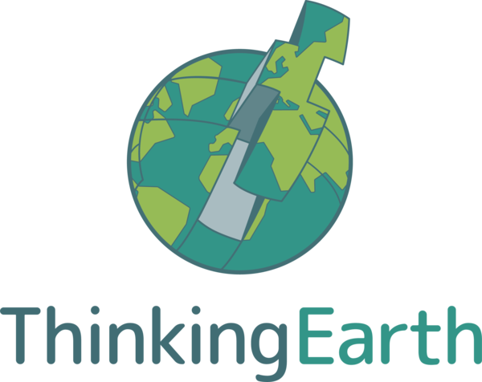

# Hackathon at BiDS 2025 - Riga, Latvia

	

		

			This repo is part of the hackathon organized by Thinking Earth, organized at the BiDS conference 2025 in Riga, Latvia. 
			Find our official webpage <a href="https://thinkingearth-hackathon.devpost.com/">here</a>.
		

	

	

## Hackathon description

The ThinkingEarth Hackathon at BiDS 25, invites AI and Earth observation enthusiasts to explore the power of Copernicus-scale foundation models. Organised by the Horizon Europe project ThinkingEarth, this challenge gives participants hands-on access to state-of-the-art resources including Earth Observation (EO) foundation models, graph-based weather forecasting tools, and vision-language models for satellite data.

Participants will work on one of three open-ended tracks:

- [ ] Track 1: EO Foundation Models: fine-tune and adapt large models for geospatial tasks
- [ ] Track 2: Weather Forecasting: evaluate and extend AI-based weather models
- [ ] Track 3: Vision-Language Models for EO: connect imagery and text to enhance EO data interpretation

Over a three-week remote development phase and a final onsite sprint at BiDS25, teams will prototype solutions, receive expert mentoring, and compete for prizes. The challenge is open to individuals and small teams with strong skills in deep learning and data science. No prior EO experience is required—just curiosity, creativity, and a drive to innovate.